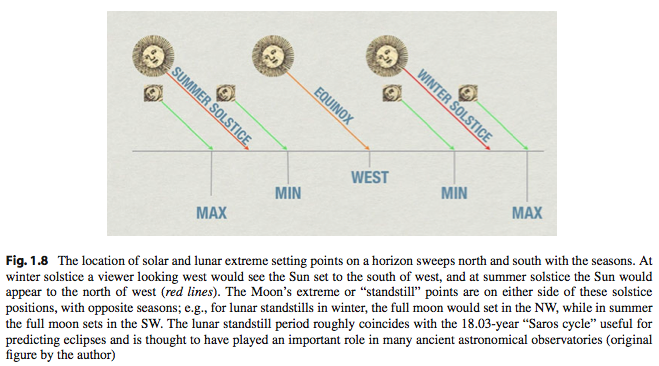
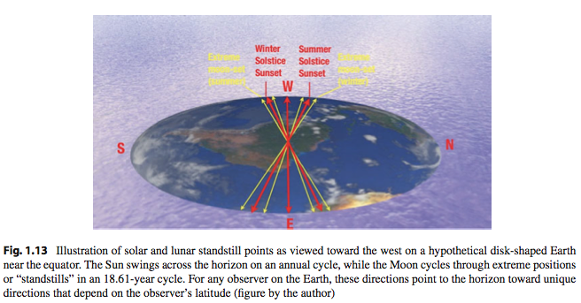
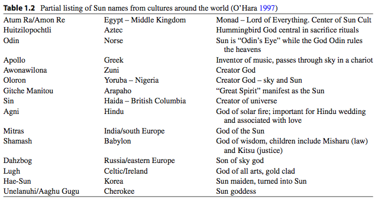

ArcheoAstronomy
================

(All from `The Power of Stars: How Celestial Observations Have Shaped Civilization`)

To the ancients, examination of the sky was dominated by the “seven luminaries”: the Sun, the Moon, Venus, Mercury, Mars, Jupiter, and Saturn. It is not a coincidence that our seven-day week is based on these objects and, in many languages, the day names correspond to these heavenly bodies.

The ordering of the day names is inherited from the ancient Babylonian astrologers, who gave each of the seven luminaries power over each of the 24 h of their day in a sequence based on the distance of the object according to their cosmology. For the Babylonians, our Earth was a slab of rock floating in a watery universe, with the planets themselves floating along rivers across the sky in the order (in distance above the Earth) of Moon, Mercury, Venus, the Sun, Mars, Jupiter, and Saturn, with the stars beyond. The later Greeks and medieval Christians adopted some aspects of this model, from which comes our sequence of day names 

The imbedding of astronomical information inside our seven-day week is an example of how ancient tradition exists among us, sometimes without us knowing it. 

La luna da 12 ciclos en un año...

Moon
-------

Ancient people associated the Moon with death and resurrection, with fertility, and with creation.

For many of the Native Americans the Moon’s surface shows a rabbit. Chinese: rabbit and toad. Navajo: moon gray areas: feathers...

The orientation of the Moon on the sky also varies with the season. In some parts of the world, the crescent moon points horizontally for much of the year, then tilts at the time of rainy season. In African tradition, the crescent moon is thought to hold moisture from the sky like a bowl.

The division of the Moon in its phases: form of resurrection by the Egyptians, who associated these lunar phases with the dissection of the God Osiris by his rival Seth, into 28 parts, and his reassembly by his consort Isis. The California Chumash and Yokut tribes considered the Moon’s phase to be the flapping of the wings of the sky eagle, or condor, and the slow movement of the wings blocking the front of the Moon resulting in the cycle of lunar phases.

One important part of moon viewing is the date of the first crescent moon. A large number of civi- lizations base their calendar on the lunar month, and the first sighting of the crescent moon is essential for starting many of the most important festivals and celebrations of the culture. Ramadan is the most famous of these festivals. Traditionally it is the job of the imam to view the crescent moon and declare its first sighting to set the beginning of Ramadan. Many times due to atmospheric conditions or dif- fering eyesight, disagreement will erupt in setting the date of this festival. Recently some Islamic countries have begun using technical means such as telescopes, and in some cases aircraft, for spot- ting the first crescent moon of the lunar month – an interesting mix of ancient lunar astronomy, and modern technology.

In addition to locating the lunar month, both ancient and modern astronomers view the Moon as it moves across the sky and try to track its larger cycles of standstills and eclipses. Because the Moon’s orbital plane is inclined 5◦ from the Earth/Sun orbital plane (known as the ecliptic plane), it will move 5◦ above and below the Sun. The Moon’s orbit has its own 18.6-year cycle in which the orbital plane slowly precesses about the celestial sphere. The intersection of the Moon’s orbital plane and the ecliptic plane is known as the “line of nodes.” Each year the Moon will move a little in its progression around the plane of the Earth’s orbit about the Sun, with a long 18.6-year period. While this long cycle continues, the Earth orbits and spins, and the path of the Moon sometimes crosses the line of nodes, giving rise to an “eclipse season.” During an eclipse season, with each new moon it is possible to have a solar eclipse, and with each full moon a lunar eclipse is possible.
How can ancient people measure such long cycles? Usually the process involves the develop- ment of writing, recording eclipses, and observing recurrences of these eclipses. Ancient Chinese and Babylonian astronomers were excellent record keepers and from their centuries of eclipse observations it was well known that eclipses recur in approximately 18-year periods known as the “Saros cycle.” With three of these Saros cycles, or approximately 54 years, eclipses can recur on the same part of the Earth.
But even without the invention of writing it is also possible to notice the long cycles of the lunar motion. The position of the Moon swings from one side of the Sun to the other, which at the extreme points give rise to what is known as a “lunar standstill.” At the standstill, the Moon is at its highest or lowest point on the celestial sphere (about 5◦ above or below the ecliptic). When this happens the Moon rises in its extreme north or south positions, something recorded by ancient builders of Stonehenge and other Native American monuments such as Chaco Canyon. Many of the buildings in Chaco Canyon and other southwest sites such as Hovenweep monument appear to have walls aligned with lunar stand- still directions and also windows that look at lunar standstills

Mercury
--------

While observing Mercury, you can contemplate on some aspects of Mercury’s significance to our ancestors. Due to its darting motions on either side of the Sun, Mercury developed the name of “quicksilver” among alchemists, who associated properties of Mercury with the process of separat- ing gold from lead.

Venus
-------

The entire period of each apparition is approximately 260 days, which was the basis of the central timekeeping period of the Aztec and Maya.

For these people Venus presented a more dramatic cycle than any other in the sky. Its dramatic reemergence in dawn or evening and its path across the sky and plunge toward the horizon por- tended many things to Mayan astronomers, who charted each of the five different Venus trajectories in their books and created tables predicting the path of Venus with a precision that still provides accurate forecasts within 1 day, even after 1500 years. The cycle of Venus for the Maya was associated with the tzolkin, the sacred calendar, in which groups of 13×20 days were kept, in combinations of number and day names, each with a special omen. The 260 days seemed to correlate well with the gestation period of humans, the period of growth for corn, and with other natural cycles of the Mayan environment.

Sumerians and Babylonians: goddess of love, sex appeal, and war, an insatiable goddess of passion.

Early Greeks associated Venus with Phosphoros, the light bearer. A separate name for Venus applied for the morning apparition of Venus (Phosphoros) and the evening apparition (Herperos). Later, the Greeks associated Venus with Aphrodite, goddess of love.

Egyptians, Venus was associated with the god Osiris, lord of everything, along with the Moon and the constellation Orion.

Sun
----

One of the principle axes of many ancient monuments is the line toward the northern “standstill point” which will enable ancient people to look at the Sun at the solstices within a sacred space. From Britain’s Stonehenge to Casa Rinconada in the Anasazi Chaco Canyon monument, a wide variety of ancient structures include the standstill to commemorate the solar year. Cardinal directions for many Native American tribes referred not to north, south, east, and west, but instead to the four directions on the horizon for the standstill points of sunrise and sunset, in the NE, SE, SW, and NW.

Mars
-----

Mars is our first of the outer planets in our survey and its motion is the most dramatic and rapid of all the outer planets as it moves across the sky. 
Mars and the Earth approach each other approximately every 18 months.
During the time of Earth’s approach, Mars turns backward in its apparent motion about the sky and comes to a stop as the Earth makes its inside move, and then slips behind as the Earth takes the lead in its inside track around the Sun.

For ancient astronomers, the dramatic retrograde loops of Mars made this planet very important for predicting the future. Its rapid march across the sky could also be one reason why this planet was assigned its war-like properties by the Greeks and Romans. The Babylonians associated Mars with the god Nergal, who is both the god of plague and war. In Greece, the planet Mars was known as Pyroeis or “fiery star.” The Egyptians considered Mars to be the “Horus of the Horizon” and spoke of Mars as “He who travels backward” in reference to the dramatic retrograde loops of the planet Mars.

Jupiter
---------

To ancient people, however, Jupiter was known mostly for its stately motion across the sky over the months in a more measured and gradual pace than Mars, but with the same basic type of motion. The retrograde loops shift
1/12 of the way across the sky with each year, highlighting a different zodiacal constellation each year, in a 12-year cycle.

The position of Jupiter in the sky moves slowly each year and travels completely around the sky over a long cycle of 12 years. This cycle served the Chinese astronomer much as an hour hand on the celestial sphere and allowed them to mark the passing years. Each of the years in the cycle, by long tradition, was associated with 1 of 12 animals, giving rise to the “Chinese zodiac.”

It is also possible to learn the Chinese year name from the stars near Jupiter. Each of our modern constellations have the Chinese equivalent at which Jupiter appears in the constellations.

Saturn
--------

Taking over 29 years to orbit the Sun, Saturn’s orbit is slow and subtle to observe.

The mysterious distant light of Saturn has inspired ancient people in many different ways and con- tinues to inspire us today. With the planet Saturn we have reached the outer limits of our ancient solar
system and now consider the outermost sphere beyond – the stars.

Stars
--------

The stars were the outermost sphere of the Greeks and Chinese, and many other cultures literally believed a shell of stars surrounded the Earth and planets.

A more widely known Egyptian conception is of stars being decorations on the body of Nut, the sky goddess. Egyptians later developed a set of decan stars for setting their solar calendar, by observing the locations of stars at sunset and sunrise and looking for the first appearance of a star in the dawn sky, known as its heliacal rising, which would happen on the same date each year. The Egyptian calendar needed this help, as their year would drift significantly without the invention of the leap year. Egyptians also worked very hard to provide the departed Pharaoh with the tools needed to take his place among the stars in the afterlife, using both the pyramids and other funerary rites to assure a successful journey.

Several Native American tales discuss the origin and nature of the stars themselves. One creation tale from the Cheyenne describe the world of the creator god Maheo as dark and silent until he started the universe as a fire and clapped his hands together within the embers of that fire, scattering the embers which became stars through the dark universe.

Another famous tale from the Navajo describes Black God carefully placing the stars in the sky by taking crystals from his pouch, to make a beautiful arrangement. While he rested, Coyote saw the pouch and thinking it was something good to eat, ran off with the pouch, spilling stars across the sky. This tale explains both the random nature of the stars and the howling of coyotes at night, who howl to apologize for crossing Black God.

Some Aboriginal people thought the stars were campfires of the sky people, while others thought
they were nautilus shells in the sky, while others imagined them to be departed ancestors. Perhaps the most interesting tale, however, involves stars as slivers cut by a giant:

*“Beyond the horizon, where no-one has ever been, there is a beautiful land with grassy valleys and tree-covered hills... The inhabitants of that land are moons.. they have no arms or legs but they can move quickly across the grass by rolling over and over. . . Outside the valley there lives a giant. He catches the wandering moon, and with his flint knife, cuts a slice from it each night, until after many nights there is nothing left but a number of shining slivers. The giant cuts them up very finely and throws them all over the sky. They are timid little creatures, the cut-up moons that become stars.”*

For Chinese, the heavens were like a “hen’s egg” with the Earth in the center like a “yolk” and the stars “supported by vapors”.

Heraclitus (500 BC) considered the stars to be “bowls turned with the hollow sides towards us, in which bright exhalations are collected and form flames”. Xenophenes (570–475 BC) stated that “the sun comes into being each day from little pieces of fire that are collected..” and that “there are innumerable suns and moons, and all things are made of earth.” One pre-Socratic view of stars that survived among the Greek and later Roman public is that the stars are a celestial fire, which we view through holes in an outer shell in the universe. This view was proposed by Parmenides (510 BC) and expanded upon by later thinkers.

If one is outdoors and examines the same stars on successive days, the close observer can see an interesting mystery. The sphere of stars not only rotates once a day, but also experiences a slight shift or extra rotation of 1◦ toward the west each day.

This can even be seen in a few days – each day a star will rise 4 min earlier or shift about 1◦ west each day.
The result is different stars are visible each day at dawn, during their “heliacal risings” and other stars disappear in the glare of the Sun at sunset during their “heliacal settings.” This more gradual or annual motion of the stars is the basis for tables of heliacal risings of stars constructed by the Greeks, Chinese, and Babylonian astronomers.

Esto tomado `aqui <http://www.vikinganswerlady.com/stars.shtml>`_ , sobre mitología de las estrellas en los vikingos:

* [Then they (the gods) took the sparks and burning embers that were flying about after they had been blown out of Muspellheimr, and placed them in the midst of the firmament (Ginnungagap) both above and below to give light heaven and earth. They gave their stations to all the fires, some fixed in the sky, some moved in a wandering course beneath the sky, but they appointed them places and ordained their courses.] (In Norse mythology, Muspelheim, also called Muspell, is a realm of fire. This realm is one of the Nine Worlds, ruled by Surtr with his consort Sinmara in some accounts.) (In Norse mythology, Ginnungagap is the primordial void, mentioned in the Gylfaginning, the Eddaic text recording Norse cosmogony. )

Constelations
---------------

VIKINGS 
++++++++++

(from `link <http://englishhistoryauthors.blogspot.dk/2013/12/what-did-vikings-and-saxons-call-stars.html>`_)

Friggerock (Frigg’s distaff)– A distaff was part of spinning equipment and was seen as the three stars in Orion’s belt. What we see as a sword hanging from that belt was seen as the spindle. The goddess Frigga is often depicted with a spinning wheel.

Thiassi’s Eyes– this consists of two Gemini stars Castor and Pollux, that are side by side of equal brightness resembling two eyes, reaching their peak in the sky at midnight in January. Thiassi was the name of a frost giant and father of Skandi goddess of winter.

Dain – Dain was the name of one of the deer who lived in the World Tree. The bright star Vega is its eye, and the four Lyra stars form its antler.

Dvalin– Another of the deer constellations, Much of the constellation  Cepheus make up the deer with the North Star its rear foot.

Durathror Yet another deer made from much of the Perseus collection.

Ratatosk – the squirrel constellation. Formed from Cassiopeia.

Eagle – the eagle constellation  is how the Norse saw Cygnus the Swan.

Nidhogg– This is the constellation of the serpent who lived and gnawed at the roots of the world tree Yggdrasill’s. The constellation we today call Scorpius, was Nidhogg.

The Wagon or Hellewagen was formed by the modern Great Bear/ Plough/ Big Dipper. It was seen as a wagon maybe carrying the dead and probably was seen as Woden’s wagon.

Loki’s Torch – This was the bright star Sirius.

Ursa Major or “The Big Dipper”
+++++++++++++++++++++++++++++++

In Western mythology, the Big Dipper is known as Ursa Major, the Great Bear, based on the myth of Jupiter hiding one of his young paramours named Callisto in the form of a bear to hide her from the wrath of his wife Juno. Her young son Arcas was hunting in the woods one day after Callisto had been changed into a bear, and accidentally shot Callisto after she rushed toward him with maternal joy. Jupiter placed them in the sky as Ursa Major and Ursa Minor in pity for their loss.

The circumpolar region was the home of the emperor for the Chinese. Each of the stars of the Big Dipper was associated with portions of the emperor’s celestial bureaucracy from which he received “the mandate of heaven.”

The Egyptian cosmology, with its emphasis on eternal life, placed great importance to the Big Dipper. The figure for the Big Dipper to Egyptians was a bull’s leg, which in many murals is shown in the company of a hippopotamus, an alligator, and several other creatures. The bull’s leg shape was used in one of the main implements of the mummification rituals, used in the “opening of the mouth” ceremony, which helped place the departed Pharaoh into the eternally living stars of the celestial pole by helping him speak the correct spells from the Book of the Dead. It is even thought by some that shafts built into the great pyramids of Giza look out into the north celestial pole, which at that time was marked by the faint star Thuban, a minor star in the constellation Draco

The same group of stars in Ursa Major has been seen by as the wagon by the Babylonians, a wagon with a team of oxen or horses in parts of Northern Europe, a plough in northwest Europe, a skunk by the Sioux, a camel by North Africans, a group of boys turned into geese by the Chumash tribe of California, and even as a shark by groups of people from the East Indies.

One interesting take on the Ursa Major is a tale from the Micmac tribe of Nova Scotia, which like many other Native Americans sees the Big Dipper as a Bear pursued by hunters. The “bowl” is the bear, and in our story the hunters include Robin, Chickadee, MooseBird, Pigeon, Blue Jay, and Owl, who form a long line of stars that go beyond the handle of the Big Dipper. The story begins with a hunt, and the birds pursue the bear across the land starting in spring when the birds and bear both emerge hungry from a long winter. As the chase goes on, the various birds fall back to form the line
in the sky. In autumn, the bear rears back and Robin hits the bear with an arrow and it falls on its back, whereupon Robin jumps on the bear to begin devouring its prey. Robin tries to shake off the blood, and in the process scatters the red color to all the trees of the Earth. This is why Robin has a red breast, and why the trees turn red each autumn, according to the story. The bear cycles endlessly in the sky, its upside down form crosses the sky in winter, and then is “reborn” in Spring, ready to repeat the cosmic hunt. This story is particularly beautiful in the way it highlights both celestial and earthly cycles, with the changing of the seasons and the rotation of the night sky in perfect synchronicity.

The Arabic names are mostly based on anatomical parts of the bear.

Vikings (from `here <http://englishhistoryauthors.blogspot.dk/2013/12/what-did-vikings-and-saxons-call-stars.html>`_): The Wagon or Hellewagen was formed by the modern Great Bear/ Plough/ Big Dipper. It was seen as a wagon maybe carrying the dead and probably was seen as Woden’s wagon. We also find the names ‘Karlavagnen’, and ‘Karlsvagn’ translated as “the man’s chariot” which, along with the name ‘Kvennavagn’ ,or “woman’s chariot” given to Ursa Minor, suggests the gods associated with chariot driving; Thor and Freyja. (`see here <https://heathen-kindred.deviantart.com/journal/Norse-Constellations-and-the-Astronomy-of-Myth-219759725>`_)

Draco – The Dragon
+++++++++++++++++++

Thuban (α Draconis). The name Thuban also comes from Arabic and is the title for the entire constellation of Draco. This star was close to the
north celestial pole during the time of Egyptians, and it is alleged that the Great Pyramid of Giza is aligned with a shaft pointed toward Thuban’s “upper culmination” or highest point in the sky during 2500 BC.

The Circumpolar Sky from Ancient China
++++++++++++++++++++++++++++++++++++++++

Chinese folk tradition is more than astrology and embodies a system of values based on thousands of years of culture. One of the most famous tales involves the constellations of Lyra and Aquila, two parts of the “Summer Triangle,” easily visible from China during the early evenings in the summer months. In the tale, Lyra is the weaving princess, Tchi-niu, and Aquila is the cowherd Kien-niou, who gaze at each other across the barrier of the Milky Way, which in this tale is a river:

*“The Princess lives with her father the Sun God, and falls in love with the cowherd, and convinces her father to bless the marriage. The two were so smitten with love that they forgot their duties, and the royal herd became scattered all over the sky, while the Princess forgot about her weaving. The King was forced to banish Kien-niou to the opposite side of the Milky Way. The Gods were saddened by this separation and arranged a bridge of magpies to be built one day each year, on the seventh day of the seventh month. On this day the two were reunited, and the land is filled with warm rain, which is the tears of joy of the reunited lovers.”*

The Arctic Inuit Sky
+++++++++++++++++++++

The celestial sphere in Inuit is known as Qilak, the home for souls of departed people, as well as the Sun and the Moon. The Qilak circles above the Earth, or Sila, and can be reached by certain shamans, who are able to travel between the Earth and sky and perhaps to worlds beyond the sky.

Seasonal appearances of the Western constellations of Orion and Taurus mark the winter. The first visibility of the stars of the Western constellations of Aquila and Lyra signals the passage of the Winter solstice and the beginning increasing light for the region.

Also in the absence of the Sun, the appearance of these stars on the horizon can signal the coming of dawn and help keep time for the Inuit. In the dark days of winter without sunrise, the stars signal the time for villagers to wake up, for children and hunters to begin their days, and for the village to start the routines of the day.

The Western constellation of Taurus, and its bright star Aldebaran, is known as Nanurjuk, which means “like, or having the spirit of a polar bear”.

One tale tells of how Nanurjuk is a polar bear being held at bay by a pack of dogs, which are the rest of the stars of the Hyades. In some versions of the story, Nanurjuk is already dead, and its red color is the blood of the polar bear. The remaining stars of Taurus are hunters and their dogs with their fires, getting ready to share the meat. Other versions of the tale have the Pleiades serving as a group of dogs or hunters, with the brightest star of the cluster serving as the bear.

The Inuit recognized the entire grouping of the Big Dipper, which they called Tukturjuit or “caribou.” 

The Autumn Stars of the Zodiac and Equator
+++++++++++++++++++++++++++++++++++++++++++

