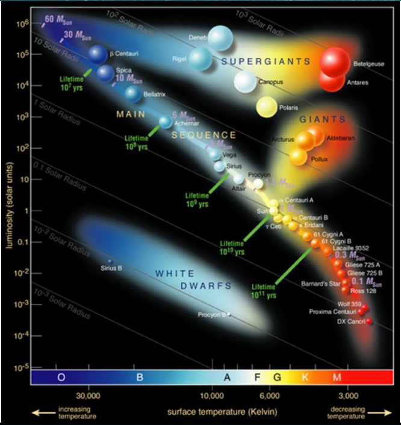
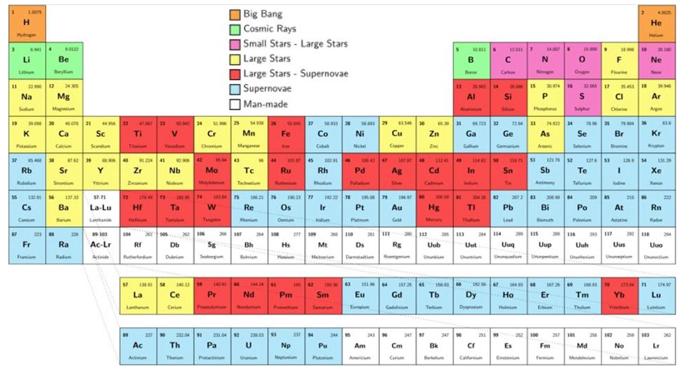

Elements: Formation
=====================

(from `here <https://medium.com/starts-with-a-bang/the-scientific-story-of-how-each-element-was-made-7a8ea114d97d>`_)

There are over 100 elements in the periodic table, of which 91 are naturally found on Earth.

But at the moment of the Big Bang, none of them existed at all.

After the first second, quarks and gluons cooled to form bound states: protons and neutrons.

After three minutes, the hot Universe fused those nucleons into helium and a tiny bit of lithium, but no further.

After tens of millions of years, we finally formed the first stars, making additional helium.

Massive enough stars become giants, fusing helium into carbon, also producing nitrogen, oxygen, neon, and magnesium.

The most massive stars become supergiants, fusing carbon, oxygen, silicon, and sulphur, reaching the transition metals.

Giant and supergiant stars create free neutrons, which can build up nuclei all the way to lead/bismuth.

Most supergiants go supernova, where fast neutrons get absorbed, reaching uranium and beyond.

Neutron star mergers create the greatest heavy element abundances of all, including gold, mercury, and platinum.

Meanwhile, cosmic rays blast nuclei apart, creating the Universe’s lithium, beryllium, and boron.

Finally, the heaviest, unstable elements are made in terrestrial laboratories.
