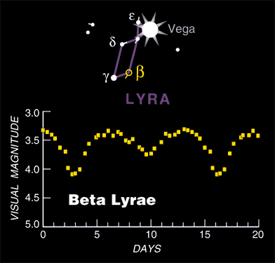
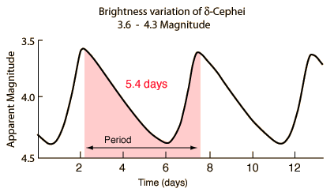

Estrellas Variables
=====================

Links
-------

http://www.as.up.krakow.pl/ephem/

ALGOL
------- 

(http://www.skyandtelescope.com/observing/celestial-objects-to-watch/the-minima-of-algol/)
(http://www.skyandtelescope.com/observing/behold-algol-star-secret/)

The star Algol (β Persei) was the first eclipsing variable star ever discovered, and it's still the most famous one. You can check on it whenever you step outdoors on nights when Perseus is in view. Algol fades and rebrightens like clockwork every 2.87 days. Its changes are very plain to the naked eye. In the middle of an eclipse it shines dimly at magnitude 3.4 instead of its usual 2.1.
Algol stays nearly that faint for two hours centered on the time of mideclipse, and it takes several additional hours to fade and to rebrighten.

Good comparison stars are Gamma (γ) Andromedae to Algol's west, magnitude 2.1, and Epsilon (ε) Persei to its east, magnitude 2.9. You can compare Algol's brightness with them at a glance; click on the star chart to see a larger version with the magnitudes of several comparison stars clearly labeled.

.. image:: images/algol_eclipses.jpg

.. image:: images/algol_chart.jpg

:: 
	Minimas:

	07/16/2017 @ 01:30 pm
	07/19/2017 @ 10:18 am
	07/22/2017 @ 07:07 am
	07/25/2017 @ 03:55 am
	07/28/2017 @ 00:44 am
	07/30/2017 @ 09:33 pm
	08/02/2017 @ 06:21 pm
	08/05/2017 @ 03:10 pm

BETA LYRAE
-----------

Beta Lyrae is an eclipsing binary of a different type. Algol-type binaries appear nearly constant between eclipses, because the brighter star of the pair is approximately spherical. But Beta Lyrae's components are so close together that they are distorted into ellipsoids by each other's gravity. As the system revolves in its 12.94-day orbital period, we see continuous change at all phases of its light curve.
The magnitude range is cataloged as 3.3 to 4.4.

.. image:: images/beta_lyrae_chart.png

DELTA CEPHEI
---------------

Delta Cephei is the prototype Cepheid variable, a class of giant stars that pulsate with periods proportional to their luminosity. This relationship is exploited by astronomers to determine the brightness — and thus distance — of Cepheids in other galaxies.
Delta's magnitude ranges from 3.5 to 4.4 in a cycle of 5.37 days. The fade from maximum to minimum is slower than the rise back to maximum, which takes less than two days.

.. image:: images/delta_cephei_chart.gif

